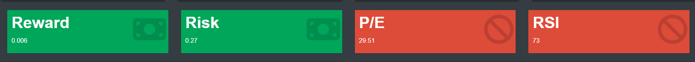
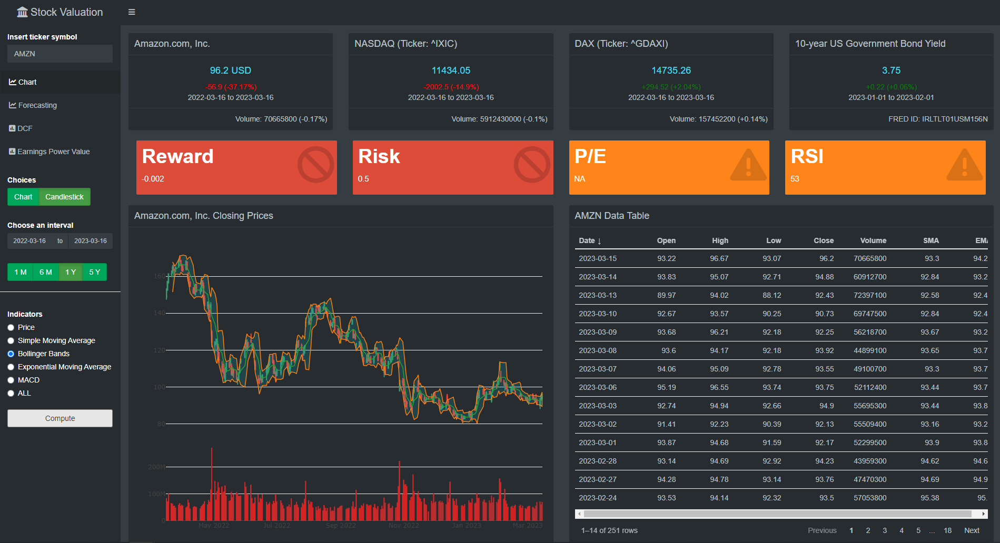
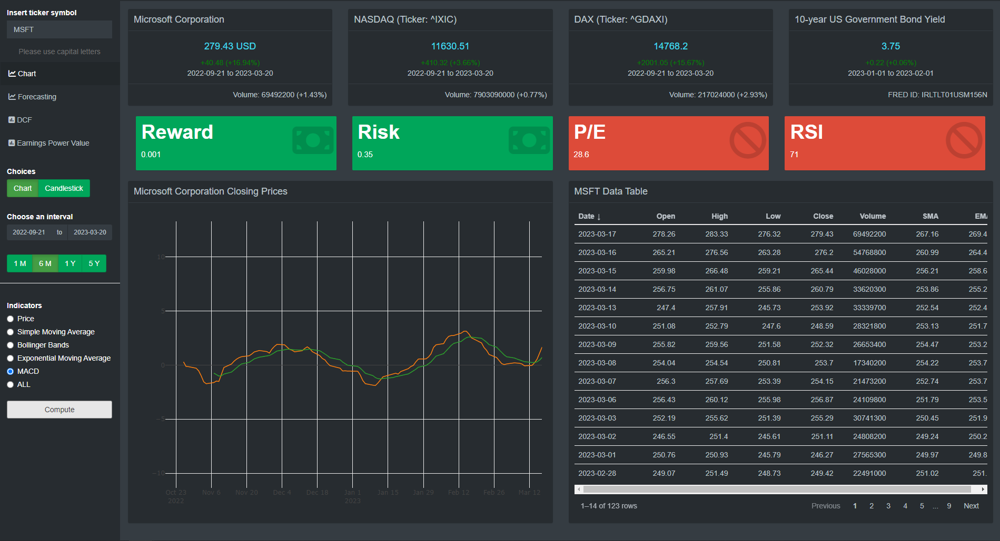
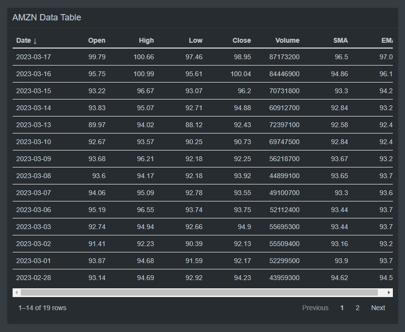

```{r setup, include=FALSE}
knitr::opts_chunk$set(echo = FALSE)
```

# Introduction

There is an abundance of investment applications and tools out there as new technologies make investing more accessible than ever before. I will add to this abundance by introducing you to my own simple version of a stock valuation app. Its purpose is to facilitate the valuation process of stocks and related investment decisions by mixing together parts of technical and fundamental analysis and displaying the results comprehensively on one platform. This first part deals with different ways of charting the closing stock price to draw conclusions on future price action. The next parts will then cover multi-step ahead forecasting of stock closing prices, discounted cash flow (DCF) analysis and earnings power value (EPV).

The following web application was created with [Shiny](https://shiny.rstudio.com/), an R package which allows for a reactive user interface. Since it was not possible for me to embed the code in an interactive way in here, I will leave it at referring to screenshots and explaining the main features and the reasoning behind them merely through code snippets. Note that, for simplicity, I will refer to sketches instead of the whole code used. This blog entry will only consider the first tab in the sidebar, called "Chart".

# R Shiny

In principle, shiny applications are structured into two parts: the user interface and the server. The user interface controls the layout and appearance of the app and the server gives it the functionality it needs to be interactive. In order to not extend this post too much, I will omit most of the server side in the following where the bulk of the code resides. Just know that it basically only involves defining a reactive function which is triggered by an input like pressing button and then handing it over to a render function where its output is transformed and styled for usage in the ui. The code chunk below demonstrates this interdependence between server and ui in a very rudimentary form. It creates an app that retrieves stock price data from [yahoo finance](https://finance.yahoo.com/) with the help of the R package [quantmod](https://cran.r-project.org/web/packages/quantmod/quantmod.pdf) and then simply plots it:

```         
# First load libraries
library(shiny)
library(shinydashboard) 
library(quantmod)

shinyApp(
  ui = dashboardPage(
    dashboardHeader(title = "Prototype"),
    dashboardSidebar(
      #   Insert a text input widget
      #   "ticker" defines the ID of this widget necessary to call it up later
      #   "Insert ticker symbol" is what is displayed in the ui
      #   through "value = " I make the default choice "AMZN"
      
      textInput("ticker", "Insert ticker symbol", value = "AMZN"), 
      actionButton("button", "Compute", class = "btn-block")
    ),
    dashboardBody(
      plotOutput("stock_price") #   the final output displayed in the main page
    )
  ),
  server = function(input, output){
    #   set up a reactive function to retrieve stock data from yahoo finance 
    #   base it on user's ticker input
    
    stock_price <- eventReactive(input$button, {
              req(input$button, input$ticker)
              tq_get(input$ticker, 
                     get  = "stock.prices",
                     complete_cases = F) %>% 
                        select(date, close) %>% 
                        as.data.frame() 
      })
    
    output$stock_price <- renderPlot({
      #   note that we call the retrieved data as a function of input in the plot
      
      plot(stock_price(), type = "l")
      
      })
  }
)
```

The basic recipe for the stock valuation tool then consists of adding more reactive features, applying different styling using boxes, tables and charts and making use of tab items with conditional panels. All the app does is essentially retrieve data like the one above and then transform and display it in a more useful way. First, I will briefly explain the ui and then explain its components.

# UI

Again, the user interface splits most shiny apps further into two integral parts: the sidebar, where users insert input into control widgets and the main body, where the input is transformed and then displayed. In my stock valuation app, the specific input widgets and their outputs are conditional on the tab the user has selected. The only exception to that is the ticker input as it stays in its place for easy access throughout usage. Using the same procedure to retrieve data on stock prices as above, historic data on any stock available at yahoo finance is downloaded into the app by selecting a ticker symbol and a time interval. The Amazon ticker symbol (= AMZN) is the default choice.

After deciding on a stock, the next input decision naturally concerns the time frame. One can either pick the standard "1 Month" to "5 Years" intervals or select a specific date in the calender. The choice of the date interval affects not only the chart and table of data, but also the colored value boxes and the boxes with general information above. More on that later.

Based on the retrieved data, the main output then is the chart. It can be represented as a simple line graph or a candlestick chart. Each representation can be modified further by the radio buttons.


The candlestick chart is often used to make inference on the behavioral patterns of the stock in technical analysis based on the display of all aspects of OHLC type data (trading volume included), whereas the simple line chart only displays closing prices.

Both options are plotted using the R package [plotly](https://plotly.com/r/). This allows for more interactivity, for example by zooming in and out or displaying single values at a given date in the chart. However, it does not get more sophisticated than that. Drawing lines manually for technical analysis as in trading platforms is not possible.

The group of radio buttons add to the chart in different ways. Although there are more sophisticated tools in the arsenal of a trader concerning trend analysis, I chose the "Stock Price", "Simple Moving Average" (or SMA), "Bollinger Bands", "Exponential Moving Average" (or EMA), "Moving Average Convergence-Divergence" (or MACD) and a combination of them to be displayed. They are easy to understand and work with and the specific values of the SMA and EMA are furthermore displayed in the data table.

# Info Boxes


These four boxes are located above all other as they contain more general information. Like the ticker input they stay in their place after switching tabs. Technically, these boxes are also just boxes with information, not info Boxes in terms of R programming.

Each box contains information on their most recent values respectively as well as absolute change and change in percent over the considered time interval. However, the last of the four boxes is an exception to that since it shows the 10-year government bond yield for the US in percent and its absolute and relative change is always related to the previous month.

The first of the boxes displays the most recent stock price of the chosen ticker. As for the following two boxes, the trading volume and its relative change in terms of the given time interval is showed in the footer. The second box contains information on the NASDAQ and the third on the DAX.

The boxes are put side-by-side by wrapping them in a `fluidRow()` in the ui. I created each box separately due to their separate content. However, the code is relatively similar. Representative for all four boxes, here is the code for the first one:

```         
output$box1 = renderUI({
      req(input$ticker, input$dateRange)
      box(width = 3, #    width and height the same for each box
          height = 12,
          
          #   Insert title which is reactive to the user's ticker symbol input
          title = paste0(getQuote(paste(input$ticker, sep="", collapse=";"), 
                                  what=yahooQF(c("Price/Sales", 
                                                 "P/E Ratio",
                                                 "Price/EPS Estimate Next Year",
                                                 "PEG Ratio",
                                                 "Dividend Yield", 
                                                 "Market Capitalization",
                                                 "Shares Outstanding",
                                                 "Name"))) %>% select("Name")),
          div(style="text-align: center;", 
              h4(paste0(stock()$close %>% 
                          last() %>% 
                          round(digits = 2), " USD"))
          ),
          
          div(style="text-align: center;", 
              paste0(paste(ifelse(range1()$absolute >= 0, "+", "-"), 
                        round(abs(range1()$absolute), 2), sep = ""), " (", 
                     paste(ifelse(range1()$percent >= 0, "+", "-"), 
                        round(abs(range1()$percent), 2), sep = ""), 
                     "%)"
              ),
              style = ifelse(range1()$absolute < 0, "color: red;", "color: green;")
          ),
          
          div(style="text-align: center;", 
              paste0(input$dateRange, collapse = " to ")
          ),
          
          footer = div(style="text-align: right;", 
                       paste0("Volume: ", last(stock()$volume), " (", 
                              paste(ifelse(range1()$volume >= 0, "+", "-"), 
                                 round(abs(range1()$volume), 2), sep = ""), 
                              "%)")
          )
      )
```

I omit the reactive function as step 1 as the box is initiated without the press of a button. The `renderUI({})` function is handed over directly from the server to the ui by calling it with `uiOutput("box1")`. The box function heavily relies on the `range1()` function. It contains values of absolute and percentage change from the most recent data entry to the last of the time interval. The `stock()` is the basic function to retrieve historical stock data.

# Value Boxes



I am yet not fully content with the value boxes, so they might be subject to change in the future. I used colors to indicate entry or exit signals, green and red respectively. Orange signals indecisiveness. However, the signals are more or less set at random. For example, to assess the risk of investing in the given stock I used the Yang-Zhang volatility estimator. This estimator makes use of OHLC data and gives out a specific value when rolling over all data from a given time interval minus 1 (`nrow(data)-1`). But which value will then be considered as "too high/too volatile"? I had a look at the most volatile stocks I could find for each date input interval and established a value of above 0.5 as too high and thus colored in red. Still, this value is not accurate and just set by observation of few different stocks.

The same problem applies to the P/E ratio. Which value is too high or too low? Here, I set all values above 20 as alarming. The P/E ratio is calculated from price per share divided by earnings per share. Thus, a high P/E ratio signals that either a company's earnings per share are low relative to its price or its price is high relative to its earnings. The same is inversed for a low P/E ratio. However, the P/E ratio and the other indicators in the value boxes should be still used in combination with other indicators. As such, keep in mind that a high P/E ratio or risk factor might not be a red flag after all. I obtain the P/E ratio from yahoo. Sometimes it is not indicated there, so the value reverts to "NA".

The "Reward" value box is easily explained as it just signals the mean of the daily rate of change for the given time interval. Negative values are marked red, positive ones green. The "RSI" values are displayed on a scale of zero to 100. The rule of thumb goes that stocks with values over 70 are considered "overbought" and thus expensive and in red. Stocks with values under 30 are considered "oversold" and thus relatively cheap and green. Values in between are in orange. It is calculated by setting in ratio average gains and average losses over a given time frame. Usually, the RSI is displayed as an oscillator or line graph. In the near future I want to add it this feature into the value box. But for now, it should be enough as an example:

```         
output$rsi <- renderValueBox({

      if(rsi() <= 30){
        valueBox("RSI", paste0(ceiling(rsi())),
                 icon = icon("money-bill"),
                 color = "green")
      } else if(rsi() > 30 && rsi() < 70){
        valueBox("RSI", paste0(ceiling(rsi())),
                 icon = icon("exclamation-triangle"),
                 color = "orange")
      } else if(rsi() >= 70){
        valueBox("RSI", paste0(ceiling(rsi())),
                 icon = icon("ban"),
                 color = "red")
      }
      
    })
```

The value boxes is deployed using `valueBox()` inside the `renderValueBox({})` function, and is then handing its output over to the ui with `valueBoxOutput("rsi")`. It draws from the previously created function `rsi()` which calculates rsi based on the historic stock price data and stores its most recent value.

# Chart

As stated earlier, the chart of the stock price is either a line graph or a candlestick chart and can be modified with a group of radio buttons which facilitate trend analysis. The first option "Price" just displays the stock price. In candlestick mode, it also adds volume as a subplot.


In combination with the option "Chart", the second option adds the simple moving average to the line graph. Although usually the 50-, 100- and 200-day moving averages are considered, here I use `n=10` trading days as number of periods to average over. In the future, I might add options to refer to previous values as well as I want put more focus on long-term investing. The SMA smoothes out volatility and thus, it is useful to make underlying price trends more visible. Also, I want to add more options to combine different moving averages (or just different time frames of the same moving average) together in one graph as their relative behavior can give information about upcoming up- or downtrends.


"Bollinger Bands" adds upper and lower bands two standard deviations +/- away from a 10-day SMA. Usually, most of the price fluctuations happen inside these bands. Thus, if a trading day breaks out of the bands, one can reasonably be certain that this is not a trend and will revert inside again in the next days. Bollinger Bands furthermore indicate whether stocks can be considered overbought or -sold when they continually touch the upper resistance or lower support line respectively. Price movements can then be anticipated accordingly.



The following exponential moving average is similar to the the SMA. Its purpose is to display price trends without noisy volatility. However, while the SMA is an unweighted moving average across the whole time frame, the EMA gives more weight to the most recent price data as it is considered more relevant. Here, it is set equally at `n=10` averaging periods.


The moving average convergence-divergence (or MACD) is computed by subtracting a long-term EMA (here `n=26` periods) from the short-term EMA (here `n=12` periods). It is then combined with a signal line, a 9-day EMA. Their relationship acts as an indicator for buy or sell decisions. A buy signal arises when the MACD line crosses above the signal line and the reverse for a crossing below the signal line. MACD can be also set in ration with the oscillating RSI which can further give more security in buy or sell decisions. This feature might be added soon. Also the display of the MACD within the price chart is not very clean which also needs to be taken care of. The screenshot is a zoomed-in version.



The last option "All" combines the price chart with trading volume, SMA, EMA, MACD + Signal and daily return. In this way, the viewer gets a comprehensive overview over these indicators and their relationships.


# Table

The table of data displays all values for the given time interval. It shows the historic stock data in OHLC format plus columns for Volume, SMA and EMA. Through the use of the R package [reactablefmtr](https://kcuilla.github.io/reactablefmtr/index.html), it is possible to sort each column with the default of the date column being arranged in descending order ranging from the most recent date to the last of the chosen time interval.



# Conclusion

In this blog post, I explored the initial phase of the R shiny series where I introduced my interactive stock valuation tool. The primary objective was to demonstrate the tool's capabilities for technical stock analysis, with a focus on trend analysis. Together with specifically selected indicators highlighted in value boxes, this web application offers a comprehensive overview over simple chart patterns, making it an easy-to-use assistant in stock valuation.

Scattered throughout this post I had some ideas on what to improve in the future. I would also be happy for your feedback and suggestions. In summary, my suggestions included:

-   Adding a graph of historic RSI performance

-   Adding an option to extend number of periods for SMA and EMA

-   Adding an option to combine different moving averages in one graph

-   Making the MACD a subplot for better readability and introducing an option to combine it with other metrics in one graph

-   Perhaps reworking the value boxes as a whole

The next part of the series will deal with forecasting stock prices using all available historic data on different estimation techniques like ARIMA, and Facebook's Prophet.
