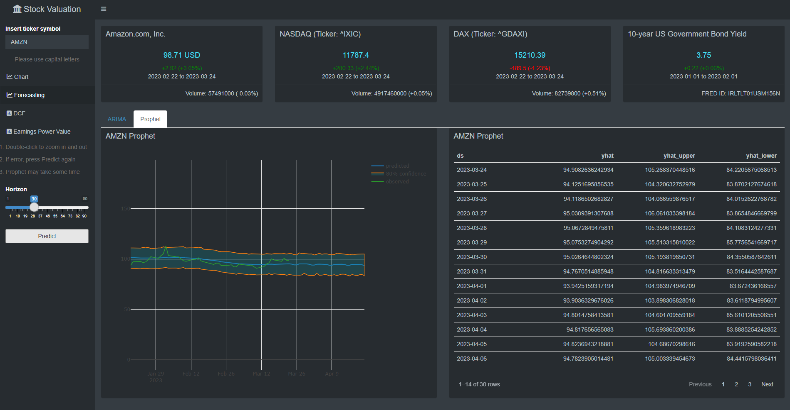
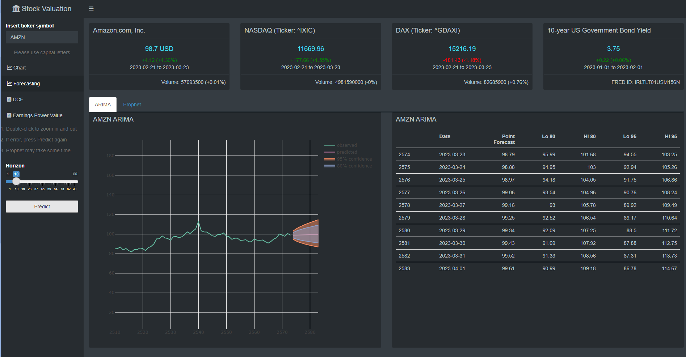
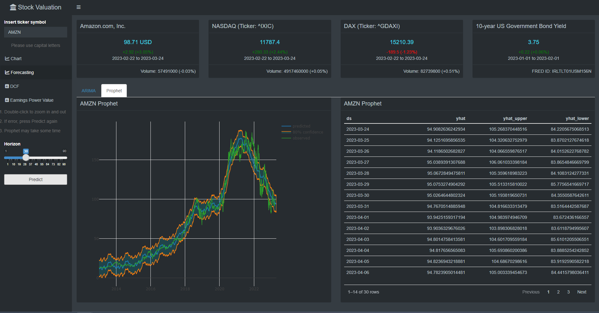

```{r setup, include=FALSE}
knitr::opts_chunk$set(echo = FALSE)
```

# Introduction

Accurately forecasting price movements is the ultimate goal of stock analysis. However, due to the volatile and nonlinear nature of stock markets, predicting price actions remains a challenge. This is further complicated by various macro and micro factors such as market sentiment, global economic conditions, political events and the company's performance. The efficient market hypothesis even suggests that it is practically impossible to predict asset prices, as they already convey all currently available information.

Still, for reasons explained next, I will show how I integrated ARIMA models and Prophet into my stock valuation app and provide a brief introduction to these methods.

# Reasoning

While it may not be possible to accurately predict stock prices, advancements in technology and computing power have made it easier to process and analyze large amounts of financial data. This has allowed for the development of more sophisticated modeling techniques, such as ARIMA and machine learning algorithms, that can identify patterns and relationships in the data that may not be apparent to the human eye. By leveraging these techniques, investors can reduce uncertainty regarding investment decisions and gain a deeper understanding of market trends. Contrary to what the efficient market hypothesis suggests, high-ranking investors have repeatedly shown that it is indeed possible to outperform the market by taking advantage of its imperfections which are rooted in the cognitive bias of the participants.

Under this impression, advanced methods such as ARIMA models and Facebook's Prophet can be employed to create more reliable forecasts than what is obtained by simple or exponential moving averages.

# UI



The main panel of the dashboard features at the top the four info boxes, as described in the initial part of the series. Underneath, users can access either the ARIMA or Prophet model output, which is dependent on the respective tab selection. The output consists of a chart and a table displaying the projected values. On default, the chart is zoomed in for greater detail, but users can view the entire time series by double-clicking on the chart. Both forecasting methods use the whole range of data available on [yahoo finance](https://de.finance.yahoo.com/).

The main panel includes a useful feature for comparing forecast performance with actual values: the ex-post out of sample forecast. Since the accuracy of Prophets forecasts can be assessed in the graph already, this metric is only available for the ARIMA model. Thereby, an ARIMA specification is trained on a designed train set where the underlying stock price data is truncated by the specified forecasting horizon $h$. In this way, users can assess the reliability of the models on a test set, allowing them to see how the model would have performed if it had been deployed $h$ periods ago. This feature provides valuable insight into the accuracy of the model with its metrics being shown in detail in the box right next to it.

# ARIMA



A cornerstone of empirical time series analysis is accurate forecasting to make informed predictions about future values based on past trends. The ARIMA model is widely recognized as one of the most established and effective techniques for achieving this. It consists of three components:

-   An Auto Regressive (AR(p)) part of order p which regresses on its own past or lagged values to predict future ones

-   An Integrated (I(d)) part of order d which eliminates non-stationary processes by differencing

-   A Moving Average (MA(q)) part of order q which attempts to predict future values based on prior forecasting errors (not to be confused with conventional moving averages in trend analysis)

The merging of these components results in an ARIMA(p,d,q) model. For better understanding, have a look at the baseline ARMA(p,q) model:

$$
\hat{y_t} = \mu + \sum_{i=0}^{p} \phi_i y_{t-i} + \sum_{j=1}^{q} \theta_j e_{t-j} + e_t
$$ Here, $\alpha$ is an intercept term, $\sum_{i=0}^{p} \phi_i y_{t-i}$ is the AR(p) process and $\sum_{j=1}^{q} \theta_j e_{t-j}$ the MA(q) process. Their respective orders p and q can be derived either from examining the (partial) autocorrelations of the specific time series $y_t$ or from the minimization of conventional information criteria like the Akaike (AIC) or the Bayesian (BIC).

An important prerequisite to forecasting with ARIMA is that the existence of stationarity in the data needs to be ensured. Stationary processes are mean-reverting. Their mean and variance remain more or less constant over time making it possible to apply standard results from statistics such as the law of large numbers and the central limit theorem. Contrary, when processes are non-stationary (textbook example: random walk), their mean and variance change over time. The stationarity property of a time series is tested through unit root tests which determine the order of integration I(d). For $d=0$, the process is said to be stationary and for $d>0$ it is non-stationary.

If a time series is characterized by an order of integration of one (which is the default case for stock price data), it is best to convert it to stationarity by first-difference for forecasting. In R, the whole process of order selection for the three ARIMA components, is done by the `auto.arima()` function. It makes use of a variation of the [Hyndman and Khandakar (2008)](https://www.jstatsoft.org/article/view/v027i03) algorithm which involves unit root tests, differencing, minimization of the AICc and maximum likelihood estimation. The general ARIMA(p,d,q) model with $d=1$ to be estimated for stock price data then is:

$$
\hat{y_t} - y_{t-1} = \mu + \sum_{i=0}^{p} \phi_i y_{t-i} + \sum_{j=1}^{q} \theta_j e_{t-j} + e_t
$$ $$
\hat{y_t} = \mu + y_{t-1} + \sum_{i=0}^{p} \phi_i y_{t-i} + \sum_{j=1}^{q} \theta_j e_{t-j} + e_t
$$ In this form, the ARIMA(p,1,q) model is ready to be applied to forecasting based on prior values of stock price data. The model produces point forecasts which are exhibited in the table of data. It also displays a 80% and a 95% confidence interval.

# Prophet



Contrary to the ARIMA model, Prophet, the open source forecasting tool created by Facebook's Data Science Team, employs an additive model where non-linear trends are fit with yearly, monthly, weekly and daily seasonality plus holiday effects. Note that ARIMA models also can be extended to SARIMA models by factoring in seasonality, although it is debatable if stock prices possess strong seasonal effects. Still, Prophet is an easy to deploy tool and widely used in forecasting. Its mathematical composition is as follows:

$$
y(t) = g(t) + s(t) + h(t) +e(t)
$$ where:

-   g(t) represents the trend

-   s(t) represents seasonal changes

-   h(t) represents holiday effects

-   and e(t) represents the error term

The fitting procedure does not require any data pre-processing like differencing to make it stationary. It estimates the whole range of historic stock closing price data accompanied by an 80% confidence interval and then forecasts values for the specified horizon.

# Conclusion

Although stock price forecasting remains a challenge, it can still benefit investment decision-making by helping to reduce uncertainty. The stock valuation app uses ARIMA models and Prophet for forecasting. These models are easy to deploy and established methods in the domain. However, the forecasting horizon is limited to a 90 day period since the models become too unreliable for longer term horizons. At a later date I want to patch the app according to the following:

-   Fix display bug

-   Add LSTM or another additional method to forecast

-   Forecast returns and volatility (GARCH)

-   Add accuracy metrics for Prophet
